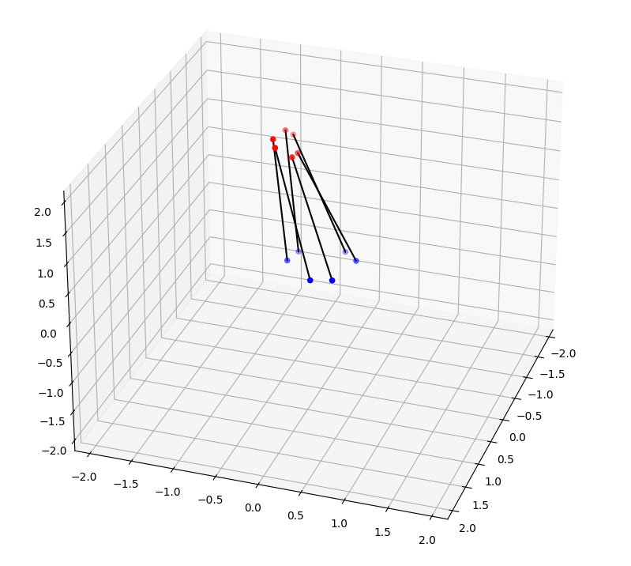

# Hexpod manipulator solver
This is an program that can be used for solving exercises regarding parallel manipulators (specifically hexpod manipulator with 6 legs)! The code quality isn't the best and would only be recommended to be used as a source not as a library if any adaptations need to be made

## Functionality
- Create a hexpod manipulator:
  - short/long edge ratio, radius for leg connection points
  - set min/max leg lengths
- Calculate reactive force on legs (force solver) need to provide
  - Pad and Base translation and rotation
  - Applied force position relative to pad and its magnitude
- Calculate pad translation and orientation given (forward kinematics)
  - A valid hexpod object and each leg length
  - Doesn't check if the configuration is possible (legs doesn't intersect)
- Calculate each leg length (inverse kinematics):
  - A valid hexpod object
  - Base and pad translation
- Display the solution in a 3d graph and print the results in console

# Examples

## Setup needed for next test cases
Alternatively just run main.py

```
import numpy as np
from hexpod import Hexpod
from forward_kinematics import ForwardKinematics
from force_solver import ForceSolver
from inverse_kinematics import InverseKinematics

#Hexpod defintion for forward kinematics solving
hexpod = Hexpod(
  base_radius=0.4, 
  pad_radius=0.2, 
  short_vs_long_angle_ratio=0.3, 
  leg_min_length=0.5, 
  leg_max_length=2)

fk = ForwardKinematics()

fs = ForceSolver() 
applied_force = np.array([0, 0, -9.81 * 0.5])
applied_force_pos_relative_to_pad = np.array([0, 1, 0])

ik = InverseKinematics()
```

## Forward kinematics

```
# Test case 1
hexpod.SetLegLengthFromRatio([0.3,0.3,0.3,0.3,0.3,0.3])
fk.PadPosRotSolver(hexpod, 0.01) 
hexpod.VisualizeAllLegConnectionPositions() #

# Test case 2
# hexpod.SetLegLengthFromRatio([0.9,0.9,1,1,1,1])
# fk.PadPosRotSolver(hexpod, 0.01) 
# hexpod.VisualizeAllLegConnectionPositions() 
```
Test case 1

Test case 2


## Force solver
Uses examples from the forward kinematics setups, but could just as well use rotations and orientations defined by the used. 

```
fs.SolveForces(hexpod, applied_force_pos_relative_to_pad, applied_force, max_error = 0.01)

print(fs.forces)

fs.VisualizeForces(hexpod, true_scale=False, max_force_size=0.5, applied_force=applied_force,applied_force_pos_relative_to_pad=applied_force_pos_relative_to_pad)
```

Test case 1


Test case 2


## Inverse kinematics

```
hexpod.pad_translation = np.array([0,0,1])
hexpod.pad_rotation = np.array([np.deg2rad(30),np.deg2rad(30),np.deg2rad(30)])
ik.LegLeangthSolver(hexpod, 0.01)
print(hexpod.leg_length)
hexpod.VisualizeAllLegConnectionPositions()
```
Test case 1
Results (leg_lengths) : ``` [0.92854456 1.02886252 1.1543641  1.17720083 0.99905217 0.97971598] ```

Visualisation


# Inner workings
## Forward kinematics
The goal of forward kinematics is to determine the position and orientation (6 degrees of freedom) of the hexapod's top pad given the lengths of its legs and the fixed base platform.

The ForwardKinematics class contains methods to solve for the pad's position and rotation using the __least_squares__ optimization method. The PadPosRotSolverEquation function calculates the difference between the actual leg lengths and the desired leg lengths for a given position and orientation of the top platform. The PadPosRotSolver function uses this equation to find the optimal position and orientation that minimizes these differences.

Equations
Leg Length Calculation:

For each leg, the length is calculated as the Euclidean distance between the connection points on the base and top platforms: $$  L_i = \sqrt{(x_{pad,i} - x_{base,i})^2 + (y_{pad,i} - y_{base,i})^2 + (z_{pad,i} - z_{base,i})^2}  $$
Where $(L_i)$ is the length of the $(i)-th$ leg, and $((x_{pad,i}, y_{pad,i}, z_{pad,i}))$ and $((x_{base,i}, y_{base,i}, z_{base,i}))$ are the coordinates of the connection points on the top and base platforms, respectively.

Objective Function:

The objective function to be minimized is the sum of the squared differences between the actual and desired leg lengths: $$ \text{Objective} = \sum_{i=1}^{6} \left( L_i - L_{desired,i} \right)^2 $$
Where $(L_{desired,i}) $ is the desired length of the $(i)-th $ leg.
By solving this optimization problem, we can determine the pad translation and rotation vector

# Force solver
The goal of the force solver is to determine the forces acting on each leg of the hexapod given the applied force and its position relative to the top pad. In addition the pad and base translation and rotation are needed to determine the forces acting on each leg.

The ForceSolver class contains methods to solve for the forces acting on each leg using the __least_squares__ optimization method. The SolveForces function calculates the forces acting on each leg that balance the applied force and minimize the difference between the actual and desired leg lengths. The SolveForces function uses the ForceSolverEquation function to calculate the difference between the actual and desired leg lengths for a given set of forces.

The ForceSolverEquation function calculates if the guessed forces are correct by translating 1D forces into 3D $$F_{3D-support} = u_{leg-unit-vector} * F_{1D-support} $$ and seeing if the sum of all forces is equal to the applied force $$ Result_{translation} = - F_{3d-applied} - \sum F_{3d-support-i}  $$ and if all bending moments are equal to zero.

 $$ Result_{moment} = r_{applied-pos} \times F_{3D-applied} - \sum r_{leg-connection-pos-i} \times F_{3D-support-i} $$

 If they are not the difference is returned and the optimization function will try to minimize this difference.

# Inverse kinematics
The goal of the inverse kinematics is to determine the lengths of the legs of the hexapod given the position and orientation of the top pad and the fixed base platform.

This is simply done by calculating the Euclidean distance between the connection points on the base and top platforms for each leg. The LegLengthSolver function calculates the length of each leg using the following equation:

$$ L_i = \sqrt{(x_{pad,i} - x_{base,i})^2 + (y_{pad,i} - y_{base,i})^2 + (z_{pad,i} - z_{base,i})^2} $$

Where $(L_i)$ is the length of the $(i)-th$ leg, and $((x_{pad,i}, y_{pad,i}, z_{pad,i}))$ and $((x_{base,i}, y_{base,i}, z_{base,i}))$ are the coordinates of the connection points on the top and base platforms, respectively.


